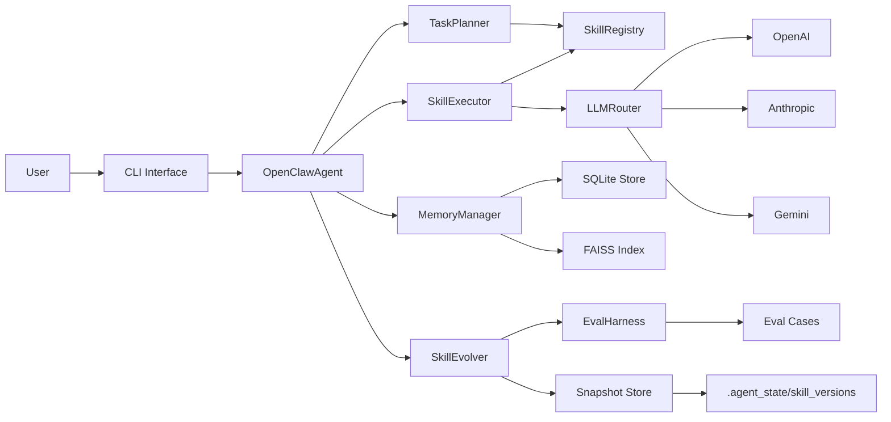
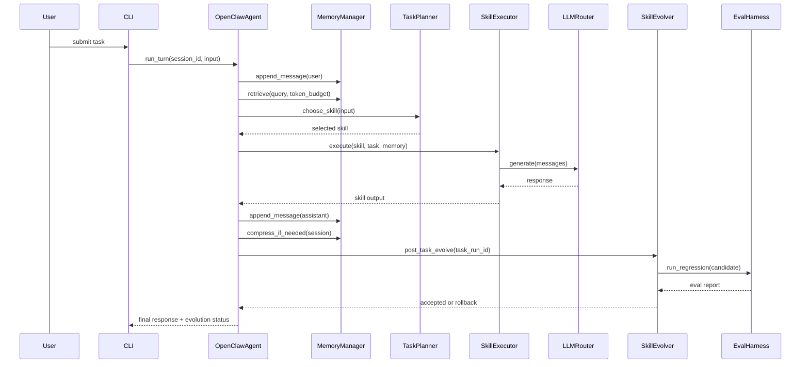
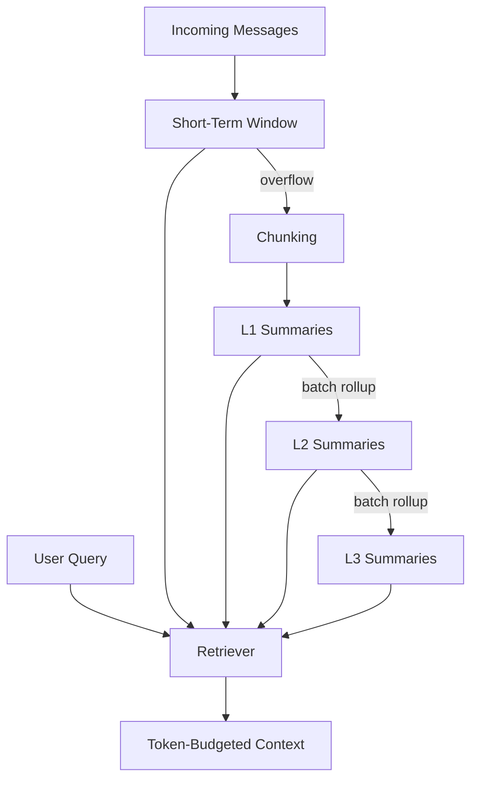
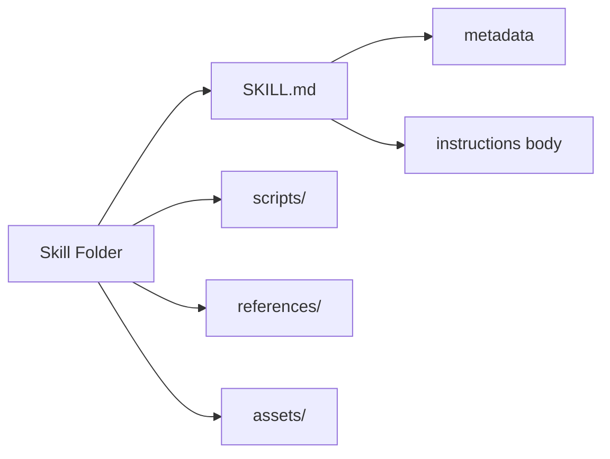
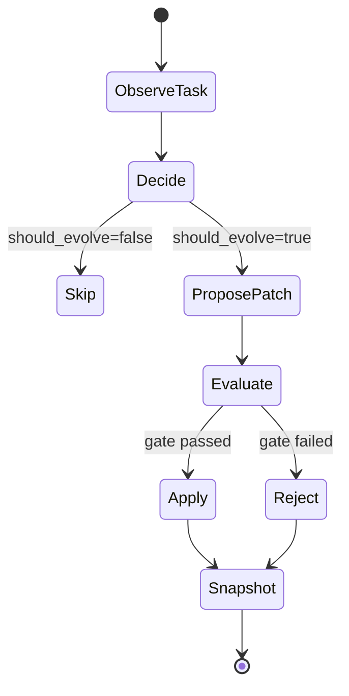
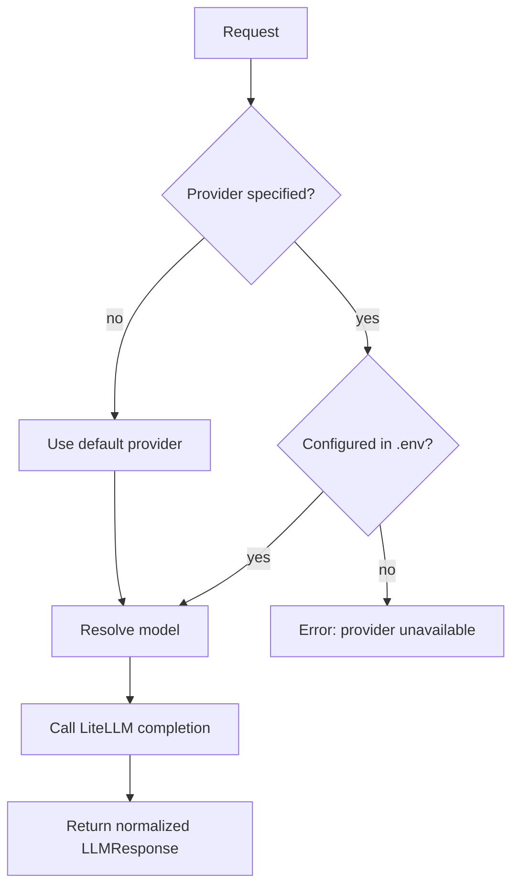

# MyOpenClaw Agentic 系統設計指南（完整版）

版本：`0.1.x`

本指南目標是把 MyOpenClaw 從「可運作」提升到「可設計、可驗證、可演化、可治理」。
你可以用這份文件來：
1. 理解 agentic 系統的核心設計概念
2. 用圖示掌握資料流與控制流
3. 依據 framework 逐步打造特定功能 agent
4. 依 design rules 迭代且避免系統性退化

## 1. Agentic 系統核心設計概念與設計哲學

MyOpenClaw 不是單一 prompt 的聊天器，而是具有以下能力的 agentic framework：
1. 可拆解能力到 skill 模組
2. 可壓縮長期記憶並檢索回注
3. 可在治理邊界內自我演化
4. 可透過評測閘門控制品質與風險

核心哲學：
1. `可觀測性優先`：所有重要行為都要可追蹤
2. `治理先於自動化`：沒有 gate 不做自動採用
3. `小步演化`：每次演化是可回滾、可比對的小變更
4. `解耦設計`：模型供應商、skills、記憶、評測彼此獨立

## 2. 全域架構圖

### 2.1 模組責任

1. `OpenClawAgent`
- 單輪任務編排（orchestration）

2. `TaskPlanner`
- 根據任務與 skill metadata 選擇最適 skill

3. `SkillRegistry`
- 解析 `skills/<name>/SKILL.md`

4. `SkillExecutor`
- 執行 skill（LLM 或 script entry）

5. `MemoryManager`
- 訊息寫入、壓縮、檢索

6. `SkillEvolver`
- 任務後演化決策、候選 patch 生成、gate 判斷與回滾

7. `EvalHarness`
- 靜態案例 + 近期回放案例評測

8. `LLMRouter`
- 多 provider 統一路由層

## 3. 單輪任務時序圖

### 3.1 關鍵設計點

1. `retrieve` 在 skill 執行前，確保每輪有 context grounding
2. `compress_if_needed` 在任務後，避免每步成本過高
3. `post_task_evolve` 在回覆後，避免阻塞主任務

## 4. 記憶系統核心概念與圖示

### 4.1 記憶分層模型

1. 短期記憶
- 近期原文，高保真

2. 長期記憶
- `L1` 事件摘要
- `L2` 主題摘要
- `L3` 長程摘要

3. 檢索合成
- recent 原文 + semantic hits + 高層摘要

### 4.2 記憶設計的本質 trade-off

1. 保真度 vs 成本
- 原文多，品質高但 token 成本高

2. 壓縮率 vs 可追溯性
- 壓縮越多越省，但需保留 source ids 防止失真難追

3. 召回廣度 vs 噪音
- top-k 太大會把噪音帶回 prompt

### 4.3 Memory 改善策略（由低風險到高風險）

1. 低風險：參數調整
- `short_term_window`
- `chunk_target_tokens`
- `rollup_batch_size`
- `embedding_dim`

2. 中風險：演算法優化
- 語義分段 chunking
- 召回去重策略
- recency + similarity 混合打分

3. 高風險：架構變更
- 真實 embedding provider
- 多索引策略
- schema migration

## 5. Skill 系統核心概念與圖示

### 5.1 Skill 是可演化的能力單元

Skill 結構：
1. metadata（frontmatter）
2. body（行為規則）
3. optional scripts/assets/references

### 5.2 Skill 設計要點

1. 單一責任
- 一個 skill 只解一類問題

2. 結構化輸出
- 固定欄位，便於 scorer 與 downstream 處理

3. 可測試 I/O
- metadata 的 inputs/outputs/constraints 要可驗證

4. 可演化穩定性
- body 需讓 evolver 能做小步調整

## 6. 自主演化核心概念與圖示

### 6.1 演化流程

### 6.2 Gate 設計目的

1. 阻止「看似變更、實則退化」
2. 把自動演化變成可治理流程
3. 讓風險限制在 skills 範圍

### 6.3 Gate 的三層檢查

1. 品質改善檢查
- `avg_delta >= threshold`

2. 回歸檢查
- 任一 case delta 不可低於 regression floor

3. 安全檢查
- 不可越界、不含危險命令模式

## 7. Provider 路由核心概念與圖示

### 7.1 路由決策圖

### 7.2 供應商策略建議

1. 將高精度任務與低成本任務分流
2. 讓 default provider 可配置
3. 設定 provider unavailable 的降級路徑

## 8. Design Rules（詳細版）

以下規則採「規則 + 原因 + 落點」形式。

### Rule 1
- 規則：每個 skill 只做一件事
- 原因：降低耦合，提升可演化性
- 落點：`skills/<name>/SKILL.md`

### Rule 2
- 規則：Skill I/O 必須可測
- 原因：無法測試就無法 gate
- 落點：`inputs/outputs/constraints`

### Rule 3
- 規則：輸出格式必須結構化
- 原因：提高 scorer 穩定性與可解析性
- 落點：Skill body 的 `Output Format`

### Rule 4
- 規則：記憶保留先 recent、再 long-term
- 原因：近期任務狀態優先級最高
- 落點：`memory/manager.py` 的 retrieve 組裝順序

### Rule 5
- 規則：壓縮摘要必含 decisions/constraints/unresolved
- 原因：避免只留語意表面
- 落點：`memory/compressor.py` prompt

### Rule 6
- 規則：演化只允許 `skills/`
- 原因：控制 blast radius
- 落點：`skills/sandbox.py` 與 evolver

### Rule 7
- 規則：演化通過前不得套用 live skill
- 原因：先評測再上線
- 落點：`skills/evolver.py`

### Rule 8
- 規則：每次演化必寫 snapshot
- 原因：可追溯與快速回滾
- 落點：`.agent_state/skill_versions/`

### Rule 9
- 規則：先補 eval cases 再調 skill
- 原因：避免無標準迭代
- 落點：`evals/cases.yaml`

### Rule 10
- 規則：每次只改一組變數
- 原因：可歸因、可回放
- 落點：實驗紀錄與 commit 粒度

### Rule 11
- 規則：記憶調參先從低風險參數開始
- 原因：避免架構變更造成不必要風險
- 落點：`config.py`

### Rule 12
- 規則：把 domain policy 放進 skill 文本
- 原因：可版本化與可演化
- 落點：skill body

### Rule 13
- 規則：評分策略要穩定，不追求一次極限
- 原因：演化會依據評分器，評分器不穩會放大噪音
- 落點：`evals/scorer.py`

### Rule 14
- 規則：任何自動化都要有失敗降級路徑
- 原因：避免整條鏈路中斷
- 落點：router、executor、evolver fallback

### Rule 15
- 規則：以任務域建立 skill map 與 case map
- 原因：能力與驗證必須同構
- 落點：`skills/` + `evals/cases.yaml`

## 9. 如何基於本框架設計你自己的 Agent 系統（決策完整流程）

### 第 1 步：定義任務域與成功標準

請至少明確以下欄位：
1. 任務類型
2. 主要輸出格式
3. 失敗定義
4. 性能目標（延遲、成本、品質）

### 第 2 步：建立 Skill Map

以任務分解出最小技能單位：
1. `ingest`
2. `reason`
3. `compose`
4. `verify`

### 第 3 步：定義 Memory Policy

需定義：
1. short-term window
2. 壓縮觸發條件
3. 檢索 token budget
4. 高層摘要是否必回注

### 第 4 步：定義 Eval Policy

需定義：
1. 靜態案例集
2. 近期任務回放案例
3. 接受門檻
4. 回歸下限

### 第 5 步：定義 Evolution Policy

需定義：
1. 允許改動的檔案範圍
2. patch 生成策略
3. gate 規則
4. 回滾策略

### 第 6 步：上線策略

1. 先固定 provider + 小 skill set
2. 觀察 N 輪任務行為
3. 再開自動演化

### 第 7 步：運行治理

1. 週期性檢視失敗案例
2. 補新 case 防止同錯重複
3. 依資料調整 memory 與 scorer

## 10. 五個情境案例（深入版）

以下案例保留與模板文件一致的核心配置，但補上架構思考與常見失敗模式。

### 案例 1：企業知識庫問答 Agent

#### 架構目標
- 輸出要可追溯，並對未知保持保守。

#### 技術設計
1. Skills
- `retrieve_knowledge`
- `answer_with_citation`

2. Memory
- 提高 short-term，保留近期查詢語境

3. Eval
- 強制 evidence/unknown 欄位

#### 常見失敗模式
1. 只給結論不給證據
2. 把記憶片段當成已驗證事實

#### 設定位置
1. `skills/retrieve_knowledge/SKILL.md`
2. `skills/answer_with_citation/SKILL.md`
3. `src/myopenclaw/config.py`
4. `src/myopenclaw/evals/cases.yaml`

#### 驗收
1. 無證據時必須明確 unknown
2. 回答必含 evidence 區塊

### 案例 2：程式碼審查 Agent

#### 架構目標
- 產生可採取行動的 findings，而非泛泛評論。

#### 技術設計
1. Skills
- `analyze_diff`
- `review_report`

2. Memory
- chunk 大一些以承載 diff context

3. Eval
- 覆蓋常見 bug 類型關鍵字

#### 常見失敗模式
1. 只描述變更，不指出風險
2. 沒有可執行修正方向

#### 設定位置
1. `skills/analyze_diff/SKILL.md`
2. `skills/review_report/SKILL.md`
3. `src/myopenclaw/evals/cases.yaml`

#### 驗收
1. 每個 finding 都要有 impact 與修正方向
2. 回歸案例不退化

### 案例 3：客服工單分流 Agent

#### 架構目標
- 以 SLA 與風險分級驅動回覆策略。

#### 技術設計
1. Skills
- `classify_ticket`
- `draft_reply`
- `escalation_policy`

2. Memory
- 保留較長客戶上下文

3. Eval
- 高風險場景需強制 escalation

#### 常見失敗模式
1. 高風險案件未升級
2. 回覆語氣與 SLA 不一致

#### 設定位置
1. `skills/classify_ticket/SKILL.md`
2. `skills/draft_reply/SKILL.md`
3. `skills/escalation_policy/SKILL.md`
4. `src/myopenclaw/config.py`
5. `src/myopenclaw/evals/cases.yaml`

#### 驗收
1. 高風險案例 `escalate=true`
2. 回覆內容含處理時限與下一步

### 案例 4：研究整合 Agent

#### 架構目標
- 同時呈現支持與反證，避免單邊結論。

#### 技術設計
1. Skills
- `extract_claims`
- `compare_evidence`
- `write_brief`

2. Memory
- 中等 window + 中等 chunk，重視跨來源對照

3. Eval
- 衝突證據案例必測

#### 常見失敗模式
1. 只選擇支持論點的證據
2. recommendation 缺 assumptions

#### 設定位置
1. `skills/extract_claims/SKILL.md`
2. `skills/compare_evidence/SKILL.md`
3. `skills/write_brief/SKILL.md`
4. `src/myopenclaw/config.py`
5. `src/myopenclaw/evals/cases.yaml`

#### 驗收
1. 必含 opposing evidence
2. 建議必附 assumptions

### 案例 5：個人執行力教練 Agent

#### 架構目標
- 跨週期追蹤承諾、阻塞、改進行動。

#### 技術設計
1. Skills
- `weekly_plan`
- `daily_focus`
- `retro_coach`

2. Memory
- 高 window + 快速 rollup，強化長期習慣洞察

3. Eval
- 強制 priorities/blockers/next actions

#### 常見失敗模式
1. 產出太抽象，無可執行下一步
2. 無法追溯過去承諾完成率

#### 設定位置
1. `skills/weekly_plan/SKILL.md`
2. `skills/daily_focus/SKILL.md`
3. `skills/retro_coach/SKILL.md`
4. `src/myopenclaw/config.py`
5. `src/myopenclaw/evals/cases.yaml`

#### 驗收
1. 可追蹤跨多輪承諾達成
2. 可產生具體改進項

## 11. 觀測與維運指標

### 11.1 任務品質指標

1. `eval pass rate`
2. `avg score`
3. `regression count`

### 11.2 記憶效果指標

1. 壓縮比（compressed tokens / raw tokens）
2. 召回命中率（query 對應片段品質）
3. token 使用效率（同品質下 token 降幅）

### 11.3 演化治理指標

1. 演化觸發率
2. 候選通過率
3. 回滾率
4. 通過後一段期間的穩定性

## 12. 反模式與避免方式

### 反模式 1
- 現象：把所有規則塞進單一 skill
- 問題：不可測、不可演化
- 修正：拆 skill map

### 反模式 2
- 現象：未定義 eval case 就開自動演化
- 問題：品質無基準，容易漂移
- 修正：先建案例再演化

### 反模式 3
- 現象：一次調整 memory 多個參數
- 問題：無法歸因
- 修正：單變量實驗

### 反模式 4
- 現象：路由錯誤時直接失敗
- 問題：可用性差
- 修正：加 fallback 或明確降級輸出

## 13. 推薦落地節奏（90 天）

### Day 1-14
1. 完成 skill map 與 base eval cases
2. 跑通主流程

### Day 15-30
1. 建立 memory baseline
2. 補齊觀測指標

### Day 31-60
1. 啟用手動 evolve run
2. 校正 gate 門檻

### Day 61-90
1. 開啟任務後自動演化
2. 週期性 review regressions

## 14. 與模板文件的對照關係

1. 本指南回答：
- 為什麼這樣設計
- 什麼原則避免退化

2. 模板文件回答：
- 怎麼快速落地
- 每個場景該填哪些內容

模板請看：`docs/CASE_TEMPLATES_zh-TW.md`

---

延伸閱讀：
1. `docs/USER_MANUAL_zh-TW.md`
2. `docs/CASE_TEMPLATES_zh-TW.md`
3. `docs/ACADEMIC_DEEP_RESEARCH_SKILLPACK_zh-TW.md`
