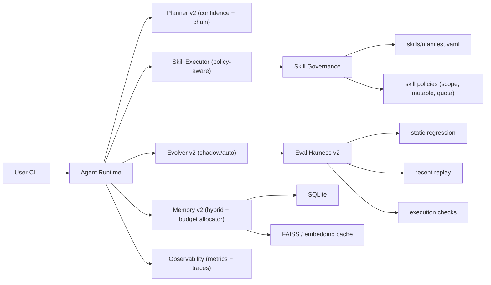

# MyOpenClaw 技術路線圖（Autonomous Evolution + Infinite Context）

版本：`2026-02-26`

本文件是目前程式碼基礎上的「可落地」技術計畫，目標是把系統提升到：
1. 可治理的自主進化
2. 近似無限上下文（可壓縮、可追溯、可評估）
3. 以 skill 為主要變更面，支援跨任務目標切換

---

## 0. 目前進度（2026-02-26）

Phase A 已先完成第一批：
1. `task_runs.trace_json` 已落地（含 migration）。
2. Planner 已輸出 `chosen_skill + confidence + top_candidates`。
3. Agent 每輪已寫入 planner/memory/executor/evolution trace。
4. CLI 已提供 `python -m myopenclaw trace tail --session <id> --limit <n>`。
5. Evolution gate 已輸出 `reject_reasons`。

下一步會依本文件順序持續完成 Phase A 剩餘指標與 Phase B。

---

## 1. 目標與邊界

### 1.1 目標
1. 提升長對話下的記憶召回品質與穩定性。
2. 將 skill 演化從文字層優化提升到行為層驗證。
3. 建立 skill 治理機制，避免技能數量與能力範圍失控。
4. 改善 CLI 使用體驗，讓使用者可觀察、可控制、可回退。

### 1.2 非目標
1. 不做 Web UI。
2. 不做分散式佈署。
3. 不把核心邏輯綁死單一模型供應商。

---

## 2. 現況差距（對應現有程式碼）

1. Planner 過於簡化  
目前 `TaskPlanner` 只做字詞重疊，缺乏置信度、技能鏈與 fallback。  
對應檔案：`src/myopenclaw/core/planner.py`

2. 演化評測可被格式投機  
`EvalHarness` 目前以「SKILL 文字 + task」模擬輸出評分，沒有執行型驗證。  
對應檔案：`src/myopenclaw/evals/harness.py`

3. Skill governance 不完整  
尚未有 manifest/policy 層，技能啟停、權限、可演化屬性沒有統一治理。  
對應檔案：`src/myopenclaw/skills/registry.py`, `src/myopenclaw/skills/sandbox.py`

4. Memory 可用但缺乏品質監控  
已有 hybrid retrieval 與分層壓縮，但缺乏系統化 KPI 與回歸指標。  
對應檔案：`src/myopenclaw/memory/manager.py`, `retriever.py`, `compressor.py`

5. 使用者可觀測性不足  
CLI 難以回答「為何選這個 skill」「抓了哪些記憶」「為何演化被拒」。  
對應檔案：`src/myopenclaw/cli.py`, `src/myopenclaw/core/agent.py`

---

## 3. 目標架構（增量式）

---

## 4. 實作階段（Technical Plan）

## Phase A：Observability Baseline（1 週）

### 目標
先建立可量測性，避免盲調。

### 主要工作
1. 新增 session/turn 級指標：
- `retrieval_hit_count`
- `retrieved_levels_distribution`
- `memory_compression_ratio`
- `planner_choice_confidence`
- `evolution_gate_reject_reason`
2. `task_runs` 增加 trace 欄位（JSON）。
3. CLI 增加 `trace` 子命令（檢視最近 N 輪關鍵決策）。

### 主要改動檔案
1. `src/myopenclaw/memory/store.py`
2. `src/myopenclaw/core/agent.py`
3. `src/myopenclaw/cli.py`
4. `src/myopenclaw/core/types.py`

### 驗收
1. 任一 turn 可回看：skill 選擇理由、memory 來源、演化結果。
2. 有基準報告可供後續 phase 對照。

---

## Phase B：Memory v2（2 週）

### 目標
把「近似無限上下文」做成可驗證品質，而不是僅可用。

### 主要工作
1. 記憶型別化：
- `event`（原始事件）
- `episodic_summary`（L1）
- `thematic_summary`（L2）
- `long_horizon_summary`（L3）
2. 檢索組裝器升級：
- hybrid score（semantic + keyword + recency）
- MMR 去重
- token budget allocator（recent > high-score chunks > L2/L3）
3. 壓縮程序背景化：
- chat 主流程不阻塞壓縮
- 壓縮任務失敗可重試
4. 記憶品質評估：
- `hit@k`
- `context_precision`
- `token_saving_ratio`

### 主要改動檔案
1. `src/myopenclaw/memory/manager.py`
2. `src/myopenclaw/memory/retriever.py`
3. `src/myopenclaw/memory/compressor.py`
4. `src/myopenclaw/memory/store.py`

### 驗收
1. 200+ turn session 下，回應品質不隨輪次明顯退化。
2. 相同任務下，token 使用量較基線下降且可追溯。

---

## Phase C：Skill Governance（1 週）

### 目標
允許 skill 擴充，但避免無限制新增與權限擴散。

### 主要工作
1. 新增 `skills/manifest.yaml`：
- `enabled`
- `capabilities`
- `mutable`
- `write_scope`
- `subprocess_policy`
- `owner`
- `risk_level`
2. Registry 改為 manifest 驅動載入。
3. Sandbox 加政策檢查：
- 禁止未授權 subprocess
- 禁止寫入 scope 外路徑
4. Skill 數量與新增速率限制：
- `max_skill_count`
- `daily_new_skill_limit`

### 主要改動檔案
1. `src/myopenclaw/skills/registry.py`
2. `src/myopenclaw/skills/sandbox.py`
3. `src/myopenclaw/config.py`
4. `src/myopenclaw/cli.py`（新增 policy 檢視）

### 驗收
1. 未註冊 skill 無法載入。
2. 未授權 skill 無法越界寫檔或提升執行權限。

---

## Phase D：Evolution v2（2 週）

### 目標
把演化從「字面改寫」提升為「行為可驗證 + 可控 rollout」。

### 主要工作
1. EvalHarness 升級為執行型回歸：
- 真正執行候選 skill（含 script）
- 固定回歸案例 + 近期任務回放
2. 引入 `shadow` 模式：
- 先執行候選 skill，不影響 live response
- 連續觀察達標才轉 auto apply
3. 演化節流：
- 同 skill cooldown（避免頻繁抖動）
- 每日演化上限
4. 安全閘門強化：
- patch 大小限制
- 高風險關鍵字掃描
- 僅 `mutable=true` skill 可演化

### 主要改動檔案
1. `src/myopenclaw/skills/evolver.py`
2. `src/myopenclaw/evals/harness.py`
3. `src/myopenclaw/evals/scorer.py`
4. `src/myopenclaw/core/agent.py`

### 驗收
1. 演化採用率上升，但 regression 次數下降。
2. 每次採用有完整證據鏈（diff + eval + replay）。

---

## Phase E：Planner/Orchestrator v2（1 週）

### 目標
強化「只改 skill 也能切不同目標」能力。

### 主要工作
1. Planner 產生 `top-k candidates + confidence`。
2. 低信心時啟用 orchestrator skill。
3. 支援 skill chain（例：retrieval -> reader -> evidence -> hypothesis）。
4. 新增任務型 profile（research/support/analysis）影響規劃偏好。

### 主要改動檔案
1. `src/myopenclaw/core/planner.py`
2. `src/myopenclaw/core/agent.py`
3. `skills/*`（新增 orchestrator metadata）

### 驗收
1. 不改 `src`，僅替換 skillpack 可完成不同任務場景。
2. skill 選擇穩定性提升（低抖動）。

---

## Phase F：UX + 控制面（1 週）

### 目標
讓使用者能直接控制演化、記憶、技能治理，不需讀程式碼。

### 主要工作
1. 新增 CLI：
- `skills enable/disable`
- `skills policy show`
- `memory inspect --session`
- `evolve mode --set off|shadow|auto`
- `trace tail --session`
2. 新增 profile 說明模板與常見策略。
3. 統一錯誤訊息與診斷建議。

### 主要改動檔案
1. `src/myopenclaw/cli.py`
2. `docs/USER_MANUAL_zh-TW.md`
3. `docs/ACADEMIC_DEEP_RESEARCH_SKILLPACK_zh-TW.md`

### 驗收
1. 新使用者可在 10 分鐘內完成設定與一次完整 run。
2. 常見錯誤可透過 CLI 診斷訊息快速定位。

---

## 5. Cross-Cutting Design Rules（治理硬限制）

1. 預設拒絕：新 skill 預設 `enabled=false`。  
2. 權限最小化：每個 skill 必須宣告 `write_scope` 與 `subprocess_policy`。  
3. 演化白名單：僅 `mutable=true` skill 可被自動演化。  
4. 演化節流：每 skill/每日都有上限。  
5. 變更可追溯：每次演化必須保留 `diff + eval + decision reason`。  
6. 安全優先：任何安全檢查 fail 一律拒絕採用。  

---

## 6. KPI 與驗收門檻

1. Memory 品質：
- `retrieval hit@5 >= 0.80`
- `context precision >= 0.70`
2. Memory 成本：
- `token_saving_ratio >= 8x`（長 session）
3. Evolution 穩定性：
- 採用後 7 天內重大回歸為 0
4. Skill 治理：
- 未註冊 skill 載入率 0%
5. UX：
- 首次上手到可完成完整流程 < 10 分鐘

---

## 7. 風險與緩解

1. 風險：評測越完整，延遲越高。  
緩解：shadow 批次化、離峰評測、分級 gate。

2. 風險：治理過嚴導致擴充困難。  
緩解：提供 profile-based policy 等級（strict/balanced/fast-experiment）。

3. 風險：記憶壓縮導致語意失真。  
緩解：保留 source ids、加入可追溯回看與抽樣人工校驗。

4. 風險：多 provider 行為差異造成不穩定。  
緩解：關鍵任務固定模型、跨模型 A/B 監測。

---

## 8. 建議執行順序

1. 先做 Phase A（可觀測性），不要跳過。  
2. 再做 Phase B（memory）與 Phase C（governance）。  
3. 然後做 Phase D（evolution），避免在弱評測上自動演化。  
4. 最後完成 Phase E/F，優化穩定性與體驗。  

---

## 9. 近期可立即開工的 Task List（Week 1）

1. 在 `MemoryStore` 新增 trace 欄位並 migration。  
2. 在 `OpenClawAgent.run_turn` 記錄 planner/retrieval/evolution trace。  
3. CLI 新增 `trace tail` 命令。  
4. 新增 `tests/test_trace_observability.py`。  
5. 產出第一版 baseline 報告（至少 3 個 session）。  
